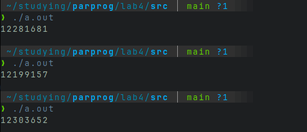
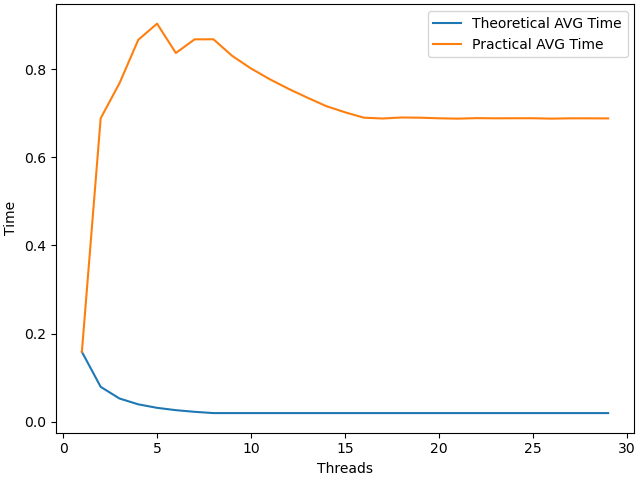
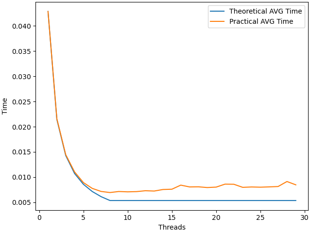

# НИЯУ МИФИ. Лабораторная работа №3. Никифоров Степан, Б21-502. 2023.
## Среда разработки
<pre>
                   -`                    defkit@archlinux
                  .o+`                   ----------------
                 `ooo/                   OS: Arch Linux x86_64
                `+oooo:                  Kernel: 6.4.12-arch1-1
               `+oooooo:                 Uptime: 2 hours, 22 mins
               -+oooooo+:                Packages: 1102 (pacman)
             `/:-:++oooo+:               Shell: bash 5.1.16
            `/++++/+++++++:              Resolution: 1920x1080
           `/++++++++++++++:             DE: GNOME 44.4
          `/+++ooooooooooooo/`           WM: Mutter
         ./ooosssso++osssssso+`          WM Theme: Adwaita
        .oossssso-````/ossssss+`         Theme: Adwaita [GTK2/3]
       -osssssso.      :ssssssso.        Icons: Adwaita [GTK2/3]
      :osssssss/        osssso+++.       Terminal: alacritty
     /ossssssss/        +ssssooo/-       Terminal Font: terminal-font
   `/ossssso+/:-        -:/+osssso+-     CPU: AMD Ryzen 7 5800X (16) @ 4.200GHz
  `+sso+:-`                 `.-/+oso:    GPU: NVIDIA GeForce GTX 1060 6GB
 `++:.                           `-/+/   Memory: 4355MiB / 15902MiB
</pre> 

## Информация об OpenMP, среде итд
Версия `Version: 201511` <br>
Дата принятия стандарта `OpenMP: Date(m/y): 11/2015` <br>
Количество доступных процессоров: `Number of processors: 16` <br>
Количество доступных потоков: `Number of max threads: 16` <br>
Можно ли использовать динамическую настройку количества используемых потоков во время работы? Нет: `Dynamic is enabled: 0` <br>
Точность таймера: `Timer precision: 1e-09s` <br>
особенности работы со вложенными параллельными областями `Nested parallelism enabled: 0 Max number of nested active parallel regions: 1` <br>
Текущее распределение нагрузки: `Schedule kind is dynamic, chunk size is 1` <br>

## Пример использования lock

```c
#include <stdio.h>
#include <unistd.h>
#include <omp.h>

omp_lock_t lock;

int main(){
  int n;
  omp_init_lock(&lock);
  int g = 0;
  int threads = 5000;
  #pragma omp parallel for private(n) shared(g) num_threads(threads)
  for(int i = 0; i < threads; i++){
      n = omp_get_thread_num();
      omp_set_lock(&lock);
      g += n;
      omp_unset_lock(&lock);
  }
  omp_destroy_lock(&lock);
  printf("%d\n", g);
}
```
Вывод этой программы 12497500, что является правильной суммой всех элементов от 1 до 5000. Если убрать лок, то программа всегда будет выдавать разные неправильные результаты. 


## Экспериментальные вычисления
Типы scedule и размеры используемых чанков:
- Static
  - default
  - 10
  - 1000
- Dynamic, 
  - default
  - 10
  - 1000
- Guided
  - default
  - 10
  - 1000

Static<br>

Static 10<br>

Static 1000<br>


Dynamic<br>

Dynamic 10<br>

Dynamic 1000<br>


Guided <br>

Guided 10<br>

Guided 1000<br>


## Анализ результатов
В целом для данной работы, использованной как пример для использования schedule dynamic и guided не имеют смысла, потому что в цикле отсутствуют баррьры.<br>
Почему динамическое расписание показало такие результаты? Вероятно потому что происходит синхронизация между потоками, что вероятно сильно замедляет работу в данном случае<br>

## Заключение
В данной работе были рассмотрены основные функции среды OpenMP, позволяющие получать её характеристики во премя исполнения программы. Был рассмотрен механизм замко и предложен бесполезный алгоритм использования. Были сравнены различные типы scedule, использующиеся в циклах для распределения нагрузки, на примере первой лабораторной работы.<br>
Также, несмотря на результаты, полученные выше, нельзя утверждать, что dynamic -- плохое расписание. При размере чанков 10000 результаты при расписании dynamic схож со статическими.
## Приложение
```c
#include <stdio.h>
#include <stdlib.h>
#include <omp.h>
#include<sys/time.h>

int main(int argc, char** argv)
{
  const int count = 50000000;     ///< Number of array elements
  if (argc < 3){
    puts("USAGE ./a.out {THREADS_NUM} {SEED}");
    return -1;
  }
  const int threads = atoi(argv[1]);         ///< Number of parallel threads to use
  const int random_seed = atoi(argv[2]); ///< RNG seed

  int* array = 0;                 ///< The array we need to find the max in
  int  max   = -1;                ///< The maximal element

  /* Initialize the RNG */
  srand(random_seed);

  /* Generate the random array */
  array = (int*)malloc(count*sizeof(int));
  for(int i=0; i<count; i++) { array[i] = rand(); }

  /* Find the maximal element */
  double t = omp_get_wtime();
  #pragma omp parallel num_threads(threads) shared(array, count) reduction(max: max) default(none)
  {
      #pragma omp for schedule(guided, 1000)
      for(int i=0; i<count; i++)
      {
          if(array[i] > max) { max = array[i]; };
      }
  }
  printf("%g", omp_get_wtime() -t );
}
```
